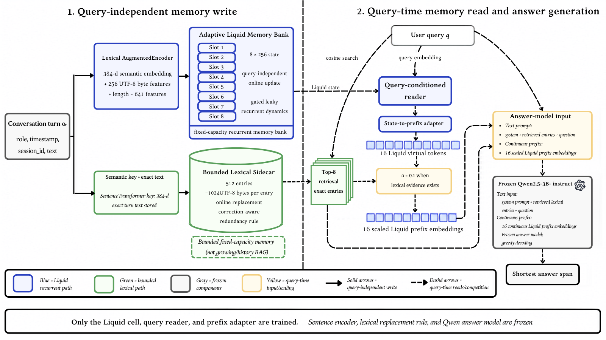

# LALM: Lexically Augmented Liquid Memory

LALM is a fixed-capacity external-memory system for long-horizon language-model
agents. It combines a liquid-inspired recurrent state for compressed context
with a bounded exact-text sidecar for copy-critical evidence, then supplies
both to a frozen Qwen2.5-3B-Instruct answer model at query time.



## At a Glance

| Component | Evaluated configuration |
| --- | --- |
| Recurrent memory | 8 slots x 256 float32 values |
| Exact-text sidecar | 512 semantic-keyed entries, up to 1,024 UTF-8 bytes each |
| Query-time evidence | Top-8 sidecar entries and 16 learned virtual tokens |
| Answer model | Frozen `Qwen2.5-3B-Instruct` |
| Logical user-memory payload | 1,318,912 bytes (1.32 MB) |

The recurrent cell, query reader, and prefix adapter are trained. The sentence
encoder, sidecar replacement policy, and answer model remain frozen.

## Memory Conditions

| Agent | Persistent memory |
| --- | --- |
| `vanilla` | None |
| `window` | Latest 50 turns |
| `rag` | Growing flat retrieval index over all turns |
| `bounded_rag` | Top-8 retrieval over the most recent 512 entries |
| `pure_liquid` | Recurrent state only |
| `lexical_only` | Bounded exact-text sidecar only |
| `lalm` | Recurrent state and exact-text sidecar |
| `lalm_zero_prefix` | Sidecar plus zero-prefix control |
| `lalm_random_prefix` | Sidecar plus deterministic random-prefix control |
| `lalm_permuted_prefix` | Sidecar plus permuted-prefix control |

## Repository Layout

```text
configs/    Evaluated training and evaluation configurations
scripts/    Training, evaluation, validation, and analysis entry points
src/        LALM agents, memory modules, datasets, and metrics
results/    Versioned checkpoints, predictions, metrics, and run manifests
analysis/   Paired-comparison outputs and paper-ready values
Figures/    Paper figures
```

Each generated run records its configuration, dataset manifest, predictions,
metrics, latency and memory measurements, environment, and hardware details.

## Setup

PowerShell examples assume the repository root and Python are available as
`python`.

```powershell
$PY = "python"
& $PY -m pip install -r requirements.txt
```

For a CUDA-enabled PyTorch installation, use the matching requirements file:

```powershell
& $PY -m pip install -r requirements-cu128.txt
```

Download the real benchmarks before running their evaluations:

```powershell
& $PY scripts/download_data.py --dataset longmemeval
& $PY scripts/download_data.py --dataset locomo
```

## Train

The reported experiments use training seeds 7 and 13. Train each checkpoint
separately and retain its path for the associated evaluations.

```powershell
& $PY scripts/train_liquid.py --config configs/base.yaml
& $PY scripts/train_liquid.py --config configs/base_seed13.yaml
```

Set the resulting checkpoint paths explicitly in each new PowerShell session:

```powershell
$CKPT_SEED7 = "results\<seed-7-train-run>\checkpoints\best.pt"
$CKPT_SEED13 = "results\<seed-13-train-run>\checkpoints\best.pt"
Test-Path $CKPT_SEED7
Test-Path $CKPT_SEED13
```

Run preflight checks before a real-benchmark evaluation:

```powershell
& $PY scripts/preflight.py --require-longmemeval --require-cuda --checkpoint $CKPT_SEED7
```

## Reproduce the Synthetic Results

Each training checkpoint is evaluated on paired synthetic streams with seeds
11, 13, and 17.

```powershell
& $PY scripts/run_multi_seed.py `
  --config configs/synthetic.yaml `
  --checkpoint $CKPT_SEED7 `
  --seeds 11 13 17 `
  --agents vanilla window rag pure_liquid lexical_only lalm
```

Repeat with `$CKPT_SEED13` to reproduce the second training-seed block. The
four horizons use 100, 75, 50, and 50 examples per evaluation stream,
respectively.

Run the targeted sham-prefix controls separately for each horizon:

```powershell
& $PY scripts/run_multi_seed.py `
  --config configs/synthetic_prefix_controls_1k.yaml `
  --checkpoint $CKPT_SEED7 `
  --seeds 11 13 17 `
  --agents lexical_only lalm lalm_zero_prefix lalm_random_prefix lalm_permuted_prefix

& $PY scripts/run_multi_seed.py `
  --config configs/synthetic_prefix_controls.yaml `
  --checkpoint $CKPT_SEED7 `
  --seeds 11 13 17 `
  --agents lexical_only lalm lalm_zero_prefix lalm_random_prefix lalm_permuted_prefix
```

Repeat the two commands with `$CKPT_SEED13` for the seed-13 controls.

## Real-Benchmark Evaluation

For LongMemEval, the reported local diagnostic split uses indices 50--499:

```powershell
& $PY scripts/run_real_benchmark.py `
  --config configs/longmemeval.yaml `
  --checkpoint $CKPT_SEED7 `
  --start-index 50 `
  --agents vanilla window rag pure_liquid lexical_only lalm
```

For LoCoMo:

```powershell
& $PY scripts/run_real_benchmark.py `
  --config configs/locomo.yaml `
  --checkpoint $CKPT_SEED7 `
  --agents vanilla window rag pure_liquid lexical_only lalm
```

Run the capacity-matched retrieval control separately; it uses FIFO recency
eviction with the same 512-entry and 1,024-byte-per-entry caps as LALM:

```powershell
& $PY scripts/run_real_benchmark.py `
  --config configs/locomo.yaml `
  --checkpoint $CKPT_SEED7 `
  --agents bounded_rag
```

`vanilla`, `window`, `rag`, and `lexical_only` are checkpoint-independent. For
the other training seed, it is sufficient to rerun `pure_liquid lalm` and reuse
the checkpoint-independent rows from the full-agent run.

## Validate and Analyze

Validate any generated run:

```powershell
& $PY scripts/validate_results.py --run-dir results\<run-directory>
Import-Csv "results\<run-directory>\metrics.csv" | Format-Table
```

Compute paired synthetic and LongMemEval pathway comparisons:

```powershell
& $PY scripts/compare_pathways.py `
  --synthetic-main results\<synthetic-multi-seed-run> `
  --longmemeval-main results\<longmemeval-run> `
  --output analysis\pathway_comparison.csv
```

Generate the synthetic and memory-scaling figures from a multi-seed run:

```powershell
& $PY scripts/generate_figures.py `
  --synthetic-run results\<synthetic-multi-seed-run> `
  --output-dir Figures
```

Compute conversation-clustered LoCoMo intervals and summarize existing runtime
logs without rerunning generation:

```powershell
& $PY scripts/analyze_camera_ready.py `
  --baseline-run results\20260709T112355Z_locomo `
  --candidate-run results\20260709T120339Z_locomo `
  --latency-run results\20260709T103718Z_longmemeval `
  --output-dir analysis\camera_ready_seed7
```

The static paper-value figure generator is also available:

```powershell
& $PY scripts/generate_paper_figures_static.py --output-dir Figures
```

## Reported Artifacts

The primary reported runs are retained under `results/`:

| Run | Purpose |
| --- | --- |
| `20260708T082250Z_train_liquid` | Training seed 13 checkpoint |
| `20260708T103354Z_multi_seed` | Seed 13 synthetic aggregate |
| `20260708T103921Z_train_liquid` | Training seed 7 checkpoint |
| `20260709T063916Z_multi_seed` | Seed 7 synthetic aggregate |
| `20260709T091658Z_multi_seed` | Seed 13 sham-prefix aggregate at 1,000 turns |
| `20260709T074140Z_multi_seed` | Seed 13 sham-prefix aggregate at 5,000 turns |
| `20260709T093908Z_multi_seed` | Seed 7 sham-prefix aggregate at 1,000 turns |
| `20260709T090013Z_multi_seed` | Seed 7 sham-prefix aggregate at 5,000 turns |
| `20260709T094752Z_longmemeval` | Seed 13 LongMemEval run |
| `20260709T103718Z_longmemeval` | Seed 7 LongMemEval run |
| `20260709T112355Z_locomo` | Seed 13 LoCoMo full-agent run |
| `20260709T120339Z_locomo` | Seed 7 LoCoMo LALM rerun |
| `20260709T121055Z_locomo` | Seed 7 LoCoMo Pure Liquid rerun |

## Notes

- LongMemEval token F1 and exact match are local diagnostics, not official
  upstream judge scores.
- LoCoMo uses the released category-aware scoring logic on text-only inputs.
- Results should be interpreted as evidence for a bounded-memory design point,
  not as universal superiority over retrieval.
